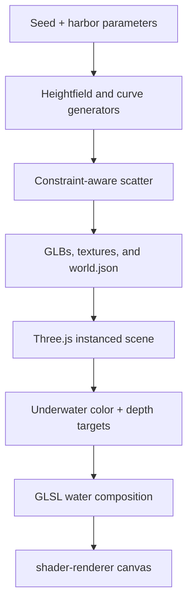

# High-Density Harbor Update Plan

Status: implemented and locally validated
Repository: `thecrimsondeveloper/Website`
Local checkout: `/workspace/scratch/bf1be130628d/website-rock-upgrade`
Planning baseline: local `main` at `20af268`
Authorized external write: one final validated commit pushed directly to `main`

## Summary

Upgrade the harbor from a sparse radial layout into a deterministic, high-density underwater scene driven by a real terrain height map and curved composition guides. The web camera remains top-down with a slight angle, the `<shader-renderer>` boundary remains unchanged, and the runtime continues to use Three.js plus the existing depth-aware GLSL water pass.

The work will be reviewed in bounded loops. Each loop changes one visible concern and may add, remove, replace, or update at most 50 logical scene items. A loop produces one reproducible candidate, locked captures, technical results, and an explicit accept-or-retain decision. Rejected candidates never replace the current winner.

## Intent

The finished harbor should have:

- A shaped seabed with shallow shelves, a deeper basin, sand ripples, and readable elevation changes.
- Curved reef bands and rock paths that feel composed without looking like perfect circles or straight rows.
- Far more rocks, coral, and fish, with deliberate empty water around the boat.
- Directional light, contact shadows, terrain ambient occlusion, normal detail, and depth-based water color that make forms readable from above.
- Refraction, reflection, caustics, and sun glints that stay stable from the web camera and oblique review angles.
- High density delivered through shared GLBs and `InstancedMesh`, not one new asset or draw call per visible object.
- Deterministic output from a complete seed and parameter encoding.

## Current baseline

| Area | Current state |
| --- | --- |
| Camera | Perspective, FOV 34, position `[0, 21, 8]`, target `[0, -1.15, 0]` |
| Seabed | One normalized `sand.glb` at `y = -2.5`, scaled to radius 16 |
| Layout | Independent radial random placement |
| Rocks | 3 logical `rocks.glb` placements |
| Coral | 13 placements across 5 coral GLBs |
| Fish | 8 instanced fish with small local orbits |
| Stars | 3 separate interactive meshes |
| Lighting | PMREM environment, hemisphere light, one shadowed directional sun |
| Shadows | PCF soft; 2048 px for high-capability/high quality, 1024 px for auto, disabled for low |
| Water | GLSL 3 scene-color refraction with depth texture, absorption, Fresnel, caustics, and glint |
| Textures | 256×256 rock and sand albedo/normal maps |

## Final outcome state

| Content | High target | Auto target | Low target | Runtime strategy |
| --- | ---: | ---: | ---: | --- |
| Rock-cluster placements | 48 | 34 | 20 | One shared GLB, four deterministic instances per cluster; 192/136/80 visible rocks |
| Coral placements | 42 | 30 | 18 | Shared by coral asset and instanced |
| Fish placements | 18 | 12 | 8 | Shared dynamic instances following serialized curves |
| Interactive stars | 6 | 6 | 6 | Separate meshes retained for simple raycast and fishing animation |
| Seabed | 1 heightfield mesh | same | same | 129×129 vertices, 32,768 triangles, shared textures |
| Terrain textures | 256×256 height, normal, albedo, AO | same | same | Generated once at build time |

The runtime rock GLB stays within the existing requirement of 500–1,000 triangles per individual rock mesh. Density comes from four deterministic transforms per logical cluster, so no extra model downloads or draw batches are required.

## Architecture



### Build-time responsibilities

- Generate all terrain heights, curve control points, placement records, quality priorities, and item IDs.
- Sample terrain height and slope before placing anything.
- Reject collisions and boat-clearance violations before export.
- Generate the seabed mesh and 256×256 terrain textures.
- Serialize only finished, deterministic scene data into `world.json`.

### Runtime responsibilities

- Load the shared GLBs once.
- Build one `InstancedMesh` per source primitive/material group.
- Display deterministic prefixes of priority-sorted placement arrays for high, auto, and low quality.
- Animate fish along precomputed curve samples and keep star-fishing interactive.
- Render the underwater scene to color/depth targets, then composite it through the water shader.
- Never generate terrain, solve collisions, or create random layouts per browser session.

## Heightfield design

Create one deterministic scalar height function over the XZ seabed:

```text
height = basin + shelf + reef_ridges + broad_noise + sand_ripples
```

| Layer | Purpose | Proposed range |
| --- | --- | --- |
| Basin | Keeps the boat over readable open water | `-2.75 m` center |
| Shelf | Raises the outer reef composition | up to `+0.70 m` |
| Reef ridges | Accentuates selected curved coral/rock bands | up to `+0.32 m` |
| Broad noise | Breaks uniform slopes without spikes | `±0.14 m` |
| Sand ripples | Fine surface relief, reinforced by normal map | `±0.045 m` |

Rules:

- Use seeded coherent noise; never call unseeded `Math.random()`.
- Clamp the final seabed between `-3.05 m` and `-1.45 m`.
- Keep every terrain point at least `0.35 m` below the water plane.
- Use a 256×256, 8-bit grayscale height texture with min/max meters recorded in `world.json`. Over the planned 1.60 m range, one stored level is about 6.3 mm.
- Export a 129×129 displaced grid as `sand.glb`; this produces 32,768 triangles and allows real shadows and depth intersections.
- Derive the normal map and terrain AO from the same height samples, so the textures and geometry cannot drift apart.
- Sample the heightfield bilinearly for object Y positions. Align rocks and coral to the local normal with a capped tilt rather than leaving all placements flat.

## Curve design

Use `THREE.CatmullRomCurve3` with `curveType = "centripetal"` during generation only. Curves guide composition; they are not rendered as visible tubes.

| Curve set | Count | Use |
| --- | ---: | --- |
| Rock belts | 3 | Large outer arcs and one broken middle arc |
| Coral ledges | 4 | Clusters on raised terrain with varied band width |
| Fish routes | 3 | Closed paths with different depth and speed ranges |

Placement method:

1. Sample by arc length rather than raw curve parameter.
2. Offset points along the curve's XZ normal with seeded jitter.
3. Apply minimum spacing and terrain-slope constraints.
4. Randomly omit short sections to prevent an obvious necklace pattern.
5. Assign stable IDs and a `priority` value used by quality profiles.
6. Serialize control points, closed state, width, and seed into `world.json` for reproduction and debugging.

## Composition and clearance rules

- Reserve a `3.4 m` radius around the boat for readable open water and fishing motion.
- Keep a visible S-shaped negative-space channel from the lower-left to upper-right of the web camera.
- Large rocks: terrain slope no greater than 38 degrees; tilt capped at 16 degrees.
- Small rocks: terrain slope no greater than 44 degrees; tilt capped at 24 degrees.
- Coral: terrain slope no greater than 30 degrees and water depth between 1.35 m and 2.85 m.
- Stars: terrain slope no greater than 18 degrees and no visual overlap with coral or rocks from the web camera.
- Fish routes: at least 0.28 m above sampled terrain and 0.18 m below the water surface.
- Reject any placement whose conservative XZ footprint overlaps another footprint by more than 12%.
- Use three rock scale classes: large `0.75–1.25`, medium `0.42–0.74`, small `0.20–0.41`.
- Avoid uniform orientation: align to terrain normal, then apply seeded yaw and limited pitch/roll variation.

## Lighting and accentuation

Keep lighting simple enough to be fast and predictable:

1. One warm directional sun remains the only shadow-casting light.
2. One hemisphere light supplies sky/ground separation.
3. One low-intensity, shadowless aqua directional fill may be added only if the multi-angle review shows crushed coral shadows.
4. Keep ACES filmic tone mapping and sRGB output.
5. Tighten the sun's orthographic shadow bounds around the actual terrain instead of using a larger fixed box.
6. Use 2048 px shadows in high, 1024 px in auto, and no dynamic shadows in low.
7. Bake terrain-only ambient occlusion into `terrain-ao.png`; do not bake the sun direction because the boat moves and the review camera changes.
8. Apply normal maps, roughness, and AO before increasing light intensity. No point light is added per rock or coral.
9. Preserve one tone-mapping step: underwater PBR is rendered into a linear target and the final water pass performs the output transform.

This provides baked micro/contact definition and live directional shadows without committing the whole scene to one fixed camera or time of day.

## Water update

The existing water pipeline already reads scene color and scene depth. Improve it rather than replacing it:

- Preserve the underwater color and depth render targets.
- Calculate optical thickness from water-fragment depth versus underwater-scene depth.
- Scale distortion by thickness and viewing angle, with the existing depth-discontinuity rejection preventing object-edge smears.
- Project caustic intensity by optical thickness, sun direction, and wave slope rather than adding it uniformly to all pixels.
- Pass the live sun direction and color as uniforms so surface glints and underwater accent lighting agree.
- Reduce refraction toward grazing angles and increase Fresnel reflection there.
- Keep high-precision half-float scene color when WebGL2 plus `EXT_color_buffer_float` is available; retain unsigned-byte fallback.
- Validate the exact GLSL runtime in a browser. The current headless Three.js water surrogate is useful for geometry and lighting review but cannot prove the production shader.

## Quality profiles and performance budgets

Placement arrays are generated once, sorted by `priority`, and truncated by quality. This keeps stable composition while reducing work.

| Metric | High | Auto | Low |
| --- | ---: | ---: | ---: |
| Visible triangles | ≤ 1,300,000 | ≤ 950,000 | ≤ 600,000 |
| Draw calls per completed frame | ≤ 45 | ≤ 38 | ≤ 26 |
| Device pixel ratio cap | 1.575 | adaptive, ≤ 1.5 | 0.93 |
| Refraction target scale | 0.75 | 0.55 | 0.35 |
| Shadow map | 2048 | 1024/2048 by memory | disabled |
| Static harbor payload | ≤ 8.5 MB | same download set | same download set |

The implemented triangle thresholds are based on static inspection of the selected high-detail Objaverse-derived coral GLBs. The original proposed 1,000,000/700,000/400,000 limits would have required visibly simplifying those source meshes. The accepted implementation keeps the higher-detail geometry, stays at or below 1.3M visible triangles in high quality, and relies on instancing plus a 45-call ceiling to keep CPU submission bounded.

Hard runtime rules:

- Do not clone a separate material for each placement.
- Do not add a light for each object or cluster.
- Do not compute heightfield noise or Poisson scatter every frame.
- Update only fish instance matrices during animation.
- Pause rendering while the component is hidden and honor reduced motion.
- Retain the image/video fallback path when WebGL initialization or asset loading fails.

## The 50-item review-loop contract

One logical scene item is one stable placement ID, such as `rocks-0031` or `coral-0024`. Touching several fields on the same ID in one loop counts as one mutation. Adding, removing, replacing, moving, rotating, or scaling an ID all count as mutations. A loop may mutate 1–50 unique IDs, never more.

Non-placement loops may change at most 12 explicitly named scalar/configuration fields. Configuration changes do not bypass the item limit: a config change that regenerates more than 50 placement IDs is rejected before capture.

Each loop has exactly one candidate and one named visual concern. If a candidate fails, the current winner is retained and the next attempt starts from that winner. This makes every accepted loop large enough to be meaningful while keeping cause and effect reviewable.

### Required artifacts per loop

- `review-run.json`: run ID, authority, seed, budget, and locked criteria.
- `attempt.json`: incumbent, named failure, allowed parameters, and exact mutation IDs.
- `candidate.json`: complete seed, generator version, parameters, and hashes.
- `technical-gates.json`: layout, geometry, interaction, and performance results.
- Ten locked-angle PNG captures plus SHA-256 checksums.
- `contact-sheet.png`: incumbent and candidate in the same order and capture profile.
- `review-feedback.json`: observations separated from hypotheses.
- `selection-decision.json`: accept candidate or retain winner.
- Updated `winner-lineage.json` only when a candidate is accepted.

Stable IDs follow:

```text
run_id       = harbor-density-<yyyymmdd>-<short-seed>
attempt_id   = <run_id>-a<four digits>
candidate_id = <attempt_id>-c01
winner_id    = <run_id>-w<four digits>
```

## Ordered implementation and review loops

### Phase 0 — Lock the baseline

Changes: 0 items.

- Record commit `20af268`, current generator hash, seed, world hash, asset hashes, counts, triangles, draw calls, and payload.
- Capture the current winner with the locked 10-angle scene profile.
- Capture the exact browser web camera at desktop and mobile sizes.
- Save the baseline before any generated file is replaced.

Checkpoint: baseline evidence is complete, deterministic, and comparable.

### Phase 1 — Add the terrain and curve model

Changes: at most 12 configuration records; 0 placement IDs.

- Add deterministic heightfield functions and terrain sampling.
- Add serialized rock, coral, and fish curve definitions.
- Upgrade the factory/world schema and parameter validation.
- Preserve current placement IDs and positions during this phase so the terrain system can be isolated.

Checkpoint: the same seed produces byte-identical height, normal, AO, mesh, and curve encodings.

### Phase 2 — Accept the heightfield seabed

Changes: 1 terrain asset plus at most 8 terrain configuration fields; 0 placement IDs.

- Regenerate `sand.glb` as the 129×129 displaced mesh.
- Generate height, normal, albedo, and AO maps at 256×256.
- Reproject existing placements onto the new heightfield without changing their XZ positions.
- Review shelf silhouette, ripples, depth readability, and water clearance.

Checkpoint: no peak crosses the water plane; terrain shadows and depth values are valid from all 10 angles.

### Phase 3 — Massive rock-dispersion pass

Changes: 48 placement IDs maximum.

- Replace the 3-placement sparse layout with 48 priority-sorted rock-cluster placements.
- This may add 45 IDs and move/update the 3 existing IDs, totaling exactly 48 touched items.
- Distribute placements along three broken curve belts with large, medium, and small scale classes.
- Preserve the boat clearance and negative-space channel.

Checkpoint: about 192 individual rock meshes are visible in high quality, but the rock source still uses four instanced primitive batches rather than 192 draw calls.

### Phase 4 — Rock-spacing correction pass

Changes: 1–50 rock placement IDs only.

- Name one failure from the Phase 3 contact sheet: crowding, repeated silhouette, weak depth layering, or excessive empty area.
- Move, rotate, rescale, or remove only the offending rock IDs.
- Do not alter coral, fish, stars, terrain, water, or lighting in this loop.

Checkpoint: the selected candidate visibly improves rock rhythm with no new overlap or budget regression.

### Phase 5 — Coral density and hierarchy pass

Changes: up to 50 coral placement IDs.

- Increase coral from 13 to 42 placements by adding 29 IDs.
- Use the remaining mutation allowance to move or resize up to 21 existing/new coral IDs if needed.
- Bias large coral toward ridge peaks and small coral toward the outer band.
- Preserve asset variety and avoid repeated adjacent silhouettes.

Checkpoint: coral reads as clustered ecosystems rather than a uniform ring and stays below the high triangle budget.

### Phase 6 — Fish-route pass

Changes: up to 28 fish placement IDs.

- Increase fish from 8 to 18 by adding 10 IDs.
- Assign all 18 fish to one of three closed Catmull-Rom routes with per-fish phase and lane offset.
- Orient fish from curve tangents instead of circular local orbit angles.
- Validate all sampled positions against terrain and water clearance.

Checkpoint: fish motion follows the composition, does not intersect terrain, and updates only the existing instanced matrices.

### Phase 7 — Star-fishing distribution pass

Changes: 6 star placement IDs maximum.

- Increase stars from 3 to 6.
- Place all six on readable shallow shelves and keep them visually separated.
- Preserve stable IDs and existing local-storage counting behavior.
- Validate pointer and keyboard fishing before accepting the candidate.

Checkpoint: every star is reachable and remains distinct in the top-down web camera.

### Phase 8 — Lighting and material accent pass

Changes: 0 placement IDs; at most 12 lighting/material fields.

- Tune sun direction, intensity, shadow bounds, bias, normal bias, and exposure together as one lighting concern.
- Add the shadowless aqua fill only if the candidate comparison proves it is needed.
- Bind terrain AO and preserve normal/roughness response.
- Reject any candidate that gains punch by clipping highlights or crushing coral detail.

Checkpoint: rock, coral, sand, and boat silhouettes remain readable across the 10-angle profile.

### Phase 9 — Water-angle pass

Changes: 0 placement IDs; at most 12 water uniform/formula fields.

- Integrate live sun uniforms, thickness-aware caustics, and angle-aware distortion/Fresnel.
- Capture the exact WebGL2 water at the web camera, two quarter angles, and one grazing angle.
- Retain existing depth-edge rejection and fallback render-target formats.

Checkpoint: no black target, NaN pixels, edge halos, excessive UV smearing, or opaque-looking water.

### Phase 10 — Performance and subtraction pass

Changes: remove, downgrade, or reprioritize at most 50 placement IDs.

- Measure all three quality profiles from the actual component.
- Remove visually redundant or hidden items before reducing texture or shadow quality.
- Reorder placement priority so auto/low preserve the strongest composition.
- Rebuild the static export only after the final winner passes.

Checkpoint: high, auto, and low all meet their respective hard budgets.

## Locked capture profile

All decision-making scene captures use the same resolution, time, seed, renderer, lighting, and camera set.

| Capture | Position/intent |
| --- | --- |
| `web-top-down` | Production camera from `world.json`; primary acceptance view |
| `north-oblique` | Moderate north quarter view |
| `north-east-oblique` | Moderate NE quarter view |
| `east-oblique` | Moderate east quarter view |
| `south-east-oblique` | Moderate SE quarter view |
| `south-oblique` | Moderate south quarter view |
| `south-west-oblique` | Moderate SW quarter view |
| `west-oblique` | Moderate west quarter view |
| `north-west-oblique` | Moderate NW quarter view |
| `grazing-water` | Low angle used to expose refraction, shadow, and horizon failures |

The final browser pass additionally captures the production web camera at 1440×900 and 390×844. Headless Three.js captures prove geometry, materials, transforms, and multi-angle composition. Browser captures separately prove the DOM/custom-element boundary, exact GLSL, WebGL2 render targets, fallbacks, and input.

## Exact file targets

### Source files to add

- `factory/harbor-world-3d/src/terrain.mjs` — heightfield, slope/normal sampling, texture channels, and terrain mesh generation.
- `factory/harbor-world-3d/src/layout.mjs` — Catmull-Rom curve encodings, arc-length sampling, constraint-aware scatter, priority sorting, and mutation reports.
- `factory/harbor-world-3d/scripts/validate-layout.mjs` — count, spacing, slope, depth, clearance, determinism, and 50-item-cap gates.
- `factory/harbor-world-3d/scripts/review-density.mjs` — locked captures, hashes, contact sheet, attempt records, and winner lineage.

### Source files to update

- `factory/harbor-world-3d/src/factory.mjs` — orchestrate the new modules, increase count ranges, upgrade schema/version, export terrain maps, and validate budgets.
- `factory/harbor-world-3d/examples/minimal-input.json` — canonical accepted seed and target counts.
- `factory/harbor-world-3d/tests/factory.test.mjs` — deterministic curve/heightfield and item-cap tests.
- `factory/harbor-world-3d/scripts/headless-run.mjs` — 10-angle locked scene captures and current-winner comparison.
- `src/components/shader-renderer/three-backend.js` — priority counts, curve-following fish, terrain textures, tightened shadows, live sun uniforms, and metrics.
- `src/components/shader-renderer/shaders/water.vert.js` — stable multi-frequency water slope data.
- `src/components/shader-renderer/shaders/water.frag.js` — thickness/angle-aware distortion, Fresnel, caustics, and synchronized sunlight.
- `scripts/validate-star-interaction.mjs` — six-star and curve-scene interaction checks.
- `package.json` — `harbor:layout` and `harbor:review` commands.

### Generated files to replace only after acceptance

- `public/assets/harbor/models/sand.glb`
- `public/assets/harbor/textures/terrain-height.png`
- `public/assets/harbor/textures/sand-normal.png`
- `public/assets/harbor/textures/sand-albedo.png`
- `public/assets/harbor/textures/terrain-ao.png`
- `public/assets/harbor/world.json`
- `public/assets/harbor/harbor.manifest.json`
- `docs/` through the existing static Pages build

### Evidence output

All loop evidence goes under:

```text
factory/harbor-world-3d/evidence/density-review/<run_id>/
├── review-run.json
├── baseline/
├── attempts/
├── winner-lineage.json
└── evidence-index.json
```

## Validation gates

### Generator and data

- Same complete encoding produces identical semantic, heightfield, geometry, placement, and capture hashes.
- Every placement ID is unique and stable.
- No attempt touches more than 50 unique placement IDs.
- Counts exactly match the selected quality target.
- All numbers are finite; all paths and asset names resolve.

### Geometry and layout

- Terrain has valid positions, normals, UVs, indices, bounds, and no degenerate triangles.
- Each individual rock mesh remains between 500 and 1,000 triangles.
- Terrain stays within the declared height range and below water.
- Boat, rock, coral, star, and fish clearances pass conservative footprint tests.
- Fish paths pass sampled terrain and surface-clearance tests.

### Visual

- Candidate and incumbent use identical capture profiles.
- The named concern visibly improves in the web camera and does not regress the other locked criteria.
- Rock repetition, curve banding, coral tangencies, star readability, shadow acne, water halos, and clipped highlights are reviewed explicitly.
- A tie, incomparable capture, or unaccepted regression retains the incumbent.

### Runtime and accessibility

- Exact `<shader-renderer>` initialization, resize, visibility pause, disposal, and fallback behavior pass in a browser.
- Pointer and keyboard star-fishing pass for all six stars.
- Reduced-motion behavior remains intact.
- Normal HTML name, navigation, portfolio text, and accessibility content remain outside the canvas and unchanged.

### Static deployment

- `npm run lint`
- `npm run harbor:test`
- `npm run harbor:generate`
- `npm run harbor:validate`
- `npm run harbor:mesh`
- `npm run harbor:layout`
- `npm run harbor:hifi`
- `npm run harbor:headless`
- `npm run harbor:interaction`
- `npm run harbor:review`
- `npm run build:pages`
- Verify `docs/index.html`, `docs/.nojekyll`, and `/Website/` asset paths from a local static server.

No GitHub Action is added. No GitHub push happens until the user explicitly requests it after the final local winner is accepted.

## Rollback and stop rules

- The first baseline and every accepted winner are immutable.
- A rejected attempt leaves generated production files and `docs/` untouched.
- Restore candidates from their complete encodings, not from undocumented manual edits.
- Retry capture without regenerating when only capture fails.
- Retry a validator without changing the candidate when only the validator fails.
- Stop if the 50-item cap is exceeded, evidence is incomparable, a hard budget conflicts with the visual goal, runtime validation is blocked, or the maximum planned loops are exhausted.
- Never use destructive Git commands to roll back user work.

## Definition of done

- The production web camera is still top-down and slightly angled.
- The seabed is visibly shaped by the deterministic heightfield.
- Rocks and coral follow broken curved composition bands without looking mechanically aligned.
- High quality shows 48 rock clusters, 42 coral, 18 fish, and 6 interactive stars.
- Lighting, AO, normal maps, shadows, caustics, and depth absorption visibly accent forms without clipping.
- Water remains convincing at the web camera, eight oblique directions, and the grazing angle.
- Every accepted loop has complete evidence and parent-linked winner lineage.
- All geometry, layout, interaction, build, fallback, and performance gates pass.
- The static `docs/` output works locally at the `/Website/` base path.
- No Actions workflow is added and no remote repository is modified without a separate explicit instruction.
